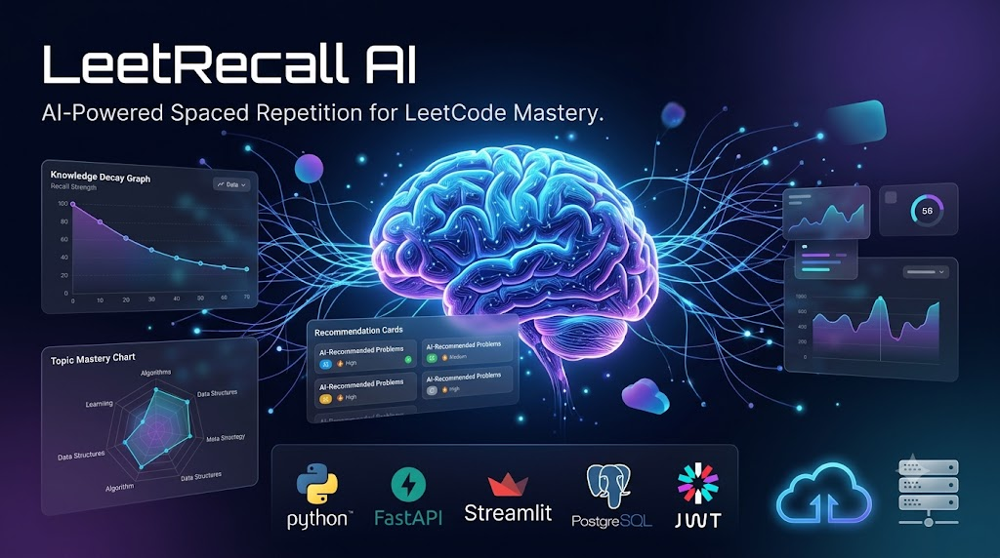
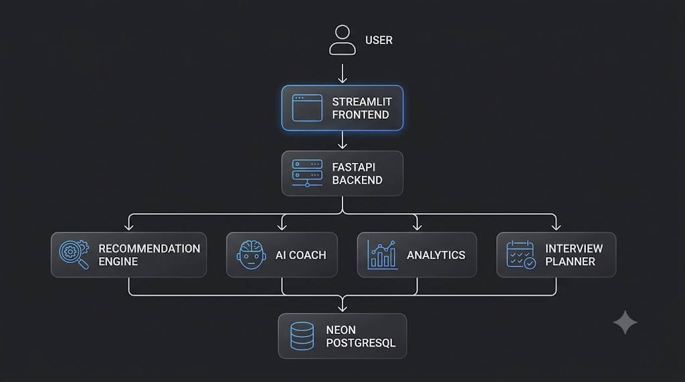
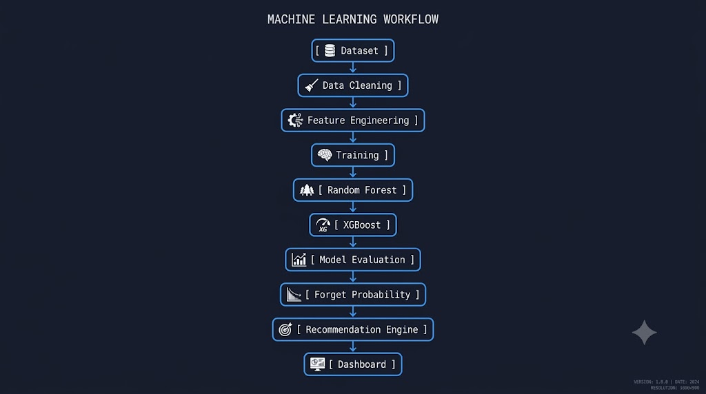
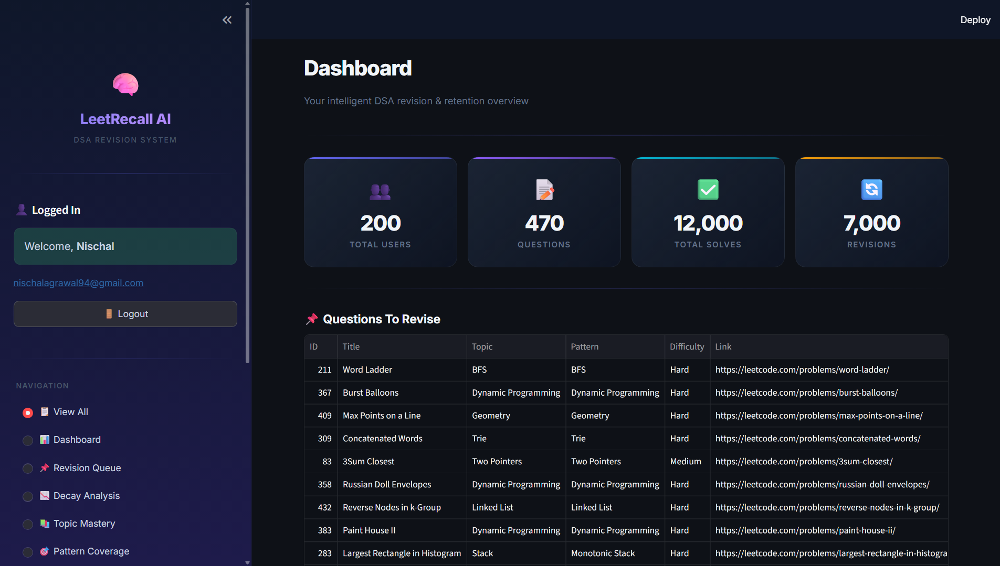
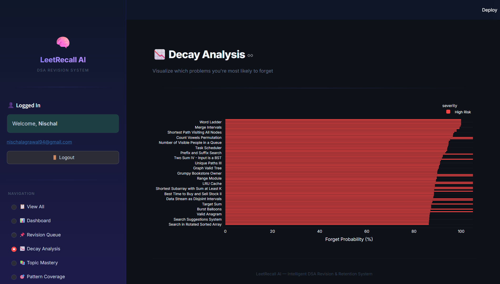
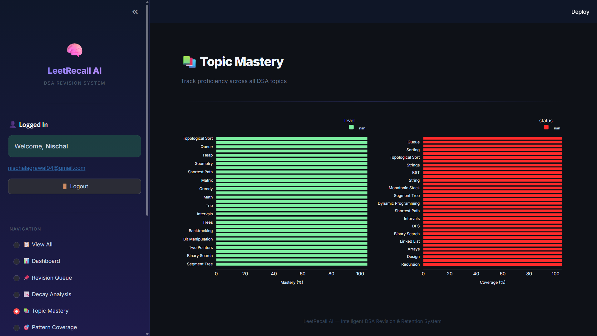
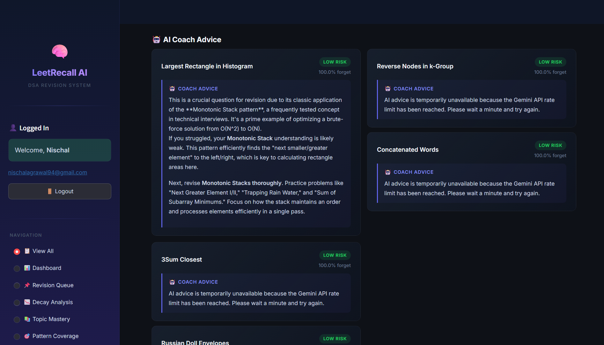
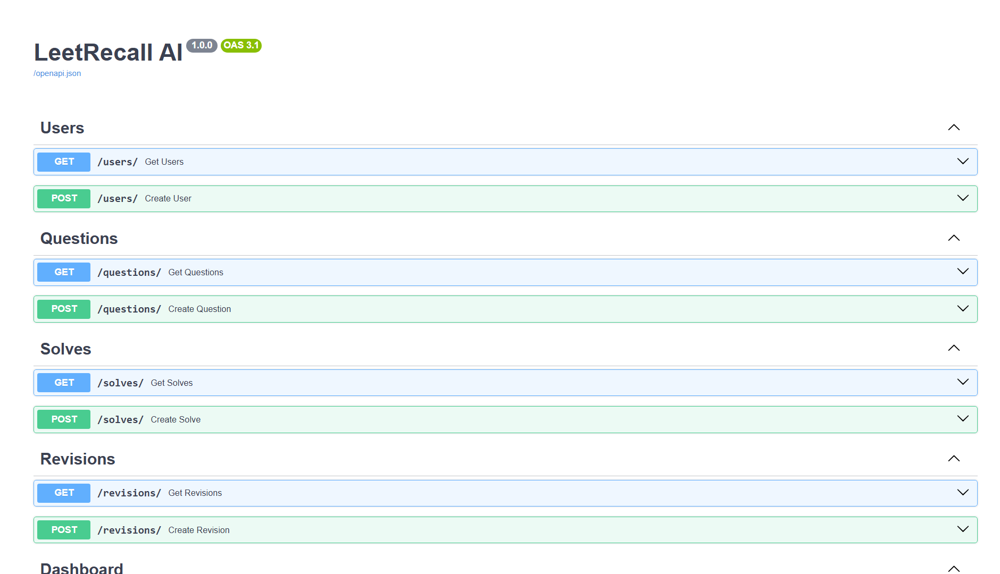
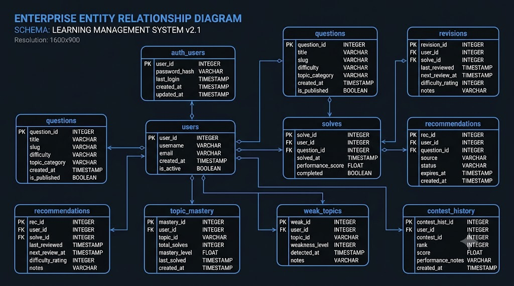
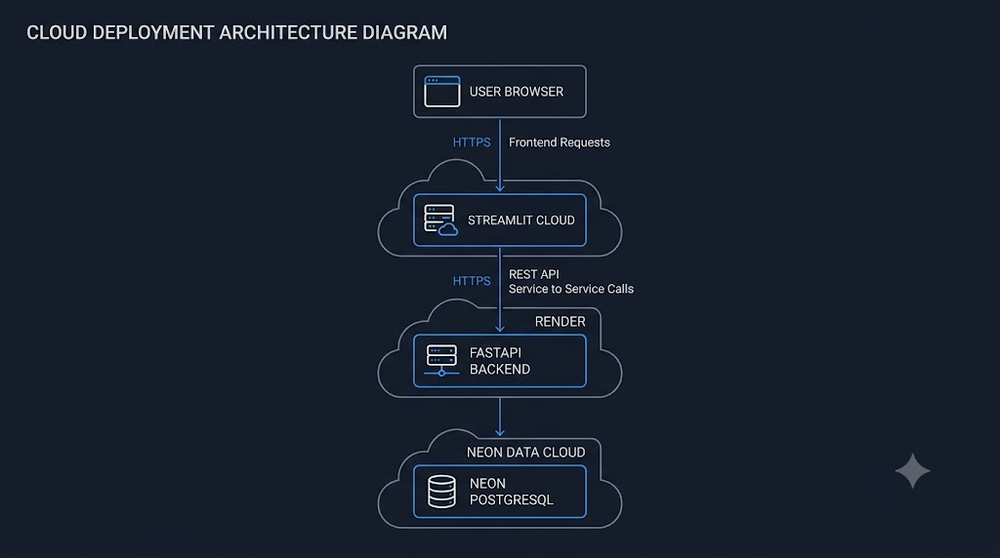

<div align="center">

# 🧠 LeetRecall AI

### Intelligent DSA Revision & Knowledge Retention Platform powered by Machine Learning

<p align="center">



</p>

<p align="center">


</p>

<p align="center">

**Predict • Analyze • Revise • Improve**

</p>

</div>

---

# 📖 Overview

LeetRecall AI is an end-to-end AI-powered learning platform designed to help competitive programmers and interview candidates retain Data Structures & Algorithms knowledge more effectively.

Instead of only recording solved problems, the platform predicts which questions are likely to be forgotten, recommends intelligent revision schedules, analyzes learning progress, and provides AI-powered study insights.

The project combines modern full-stack development with Machine Learning to create a production-style intelligent revision assistant.

---

# ❓ Problem Statement

Most programmers solve hundreds of DSA problems during interview preparation.

However, after a few weeks they usually forget

- important patterns
- tricky algorithms
- problem-solving intuition

Traditional coding platforms answer:

> **"Which questions have you solved?"**

LeetRecall AI answers:

> **"Which questions are you likely to forget next?"**

---

# 💡 Solution

LeetRecall AI uses Machine Learning models to estimate knowledge retention.

Based on predicted forgetting probability, revision history and topic analytics, it generates personalized revision recommendations instead of random practice.

The platform also provides rich dashboards for:

- Knowledge Decay
- Topic Mastery
- Weak Areas
- Pattern Coverage
- Contest Analysis
- AI Coaching
- Interview Planning

---

# 🚀 Key Features

| Feature | Description |
|----------|-------------|
| 🔐 Secure Authentication | JWT-based Signup, Login and Logout |
| 🤖 ML Recommendation Engine | Predicts revision priorities using Machine Learning |
| 📉 Knowledge Decay | Estimates forgetting probability of solved questions |
| 📚 Topic Mastery | Measures proficiency across DSA topics |
| 🎯 Pattern Coverage | Tracks exposure to algorithmic patterns |
| ⚠️ Weak Topic Detection | Finds concepts requiring revision |
| 🏆 Contest Analyzer | Analyzes coding contest performance |
| 🧠 AI Coach | Generates intelligent study recommendations |
| 📅 Interview Planner | Creates structured interview preparation plans |
| ☁️ Cloud Deployment | One Vercel project and domain, with Neon PostgreSQL |

---

# 🏗️ System Architecture

<p align="center">



</p>

The application follows a modular multi-layer architecture separating the React frontend, Express API, Python ML inference layer, and PostgreSQL data layer.

```text
                    User
                      │
                      ▼
               React + Vite Frontend
                      │
             REST API Requests
                      │
                      ▼
           Node.js + Express Backend
                      │
                      ▼
       /api/ml/* Python Inference Layer
                      │
                      ▼
        Pure Python Random Forest Evaluator
                      │
                      ▼
             PostgreSQL / Neon Database
```

This architecture ensures:

- a single-domain user experience
- modern frontend development with React and Vite
- preserved Python ML pipeline without relying on heavy data-science dependencies
- compatibility with existing recommendation logic and database semantics
- a deployable architecture suitable for one Vercel project with frontend and API routes under the same domain

To bypass Vercel's strict 225 MB free-tier serverless size limit (which natively prevents deploying `scikit-learn`, `pandas`, and `xgboost`), the Python inference layer was engineered to be highly optimized. The trained Random Forest model trees were exported into a lightweight `rf.json` structure, which the `api/ml/predict.py` script traverses in pure Python without needing external ML libraries. This guarantees lightning-fast cold starts and a bundled deployment size well within Vercel's limits.

- Modular backend services
- Easy scalability
- Separation of concerns
- Independent ML modules
- Secure authentication
- Cloud deployment compatibility

---

# 🎯 Why This Project?

LeetRecall AI demonstrates practical integration of

- Machine Learning
- Backend Development
- Frontend Development
- Database Design
- Authentication
- REST APIs
- Cloud Deployment
- Interactive Analytics


- Modern React + Vite frontend
- Production-style Express backend
- Innovative zero-dependency Python ML inference layer (JSON Tree Evaluator)
- JWT Authentication
- Password Hashing with bcrypt
- PostgreSQL-ready data layer
- Cloud deployment compatible with one-domain deployment
- RESTful APIs
- Modular Project Structure

---

# 🤖 Machine Learning Pipeline

<p align="center">



</p>

Machine Learning is the core intelligence behind LeetRecall AI.

Instead of recommending random problems, the platform predicts which solved questions are most likely to be forgotten and intelligently prioritizes revision.

---

## Pipeline Overview

```text
Dataset
    │
    ▼
Data Cleaning
    │
    ▼
Feature Engineering
    │
    ▼
Model Training
    │
    ├──────────────┐
    ▼              ▼
Random Forest   XGBoost
    │              │
    └──────┬───────┘
           ▼
Model Evaluation
           │
           ▼
Forget Probability Prediction
           │
           ▼
Recommendation Engine
           │
           ▼
Interactive Dashboard
```

---

## Dataset

The project uses a realistic simulated dataset representing learner activity.

The dataset includes:

- User Profiles
- Solved Questions
- Revision History
- Contest Performance
- Topic Distribution
- Pattern Distribution
- Difficulty Levels
- Recommendation Records

This allows the recommendation engine and analytics modules to behave like a production platform while remaining easy to demonstrate.

---

## Data Processing

Before training, the dataset undergoes preprocessing:

- Missing value handling
- Duplicate removal
- Feature extraction
- Numerical encoding
- Data validation
- Normalization where applicable

This ensures clean, consistent input for model training.

---

## Machine Learning Models

Two supervised learning models were evaluated.

| Model | Purpose |
|--------|----------|
| Baseline Logic | Spaced-repetition fallbacks |
| Random Forest | Final recommendation model |

After evaluation, **Random Forest** was selected due to its strong predictive performance and seamless translation into a low-memory, zero-dependency JSON structure for Vercel deployment.

---

## Recommendation Engine

The recommendation engine combines multiple signals instead of relying on a single metric.

It considers:

- Forget Probability
- Previous Revision History
- Topic
- Difficulty Level
- Learning Progress
- Historical Performance

The result is a prioritized revision queue tailored to maximize long-term retention.

---

## Why Machine Learning?

Traditional revision systems simply display solved questions.

LeetRecall AI goes further by answering:

> **Which problems should be revised first to minimize forgetting?**

This predictive approach makes revision more efficient and data-driven.

---

# 📊 Interactive Dashboard

<p align="center">



</p>

The dashboard serves as the central interface of the platform.

It aggregates insights from the recommendation engine, analytics services, and machine learning models into an interactive visual experience.

### Dashboard Highlights

- Personalized revision insights
- Learning statistics
- Interactive charts
- Recommendation summaries
- Performance analytics
- Secure authenticated access

---

# 📉 Knowledge Decay Analysis

<p align="center">



</p>

Knowledge retention naturally decreases over time if concepts are not revised.

The Knowledge Decay module estimates the probability that a solved problem has been forgotten.

Instead of encouraging random practice, users receive revision suggestions based on predicted retention.

### Benefits

- Smarter revision scheduling
- Reduced forgetting
- Better interview preparation
- Improved long-term retention

---

# 📚 Topic Mastery

<p align="center">



</p>

Topic Mastery provides a high-level overview of a learner's strengths and weaknesses across different DSA topics.

Examples include:

- Arrays
- Strings
- Trees
- Graphs
- Dynamic Programming
- Greedy Algorithms
- Binary Search
- Sliding Window

This allows learners to focus on topics that require additional practice.

---

# 🎯 Pattern Coverage

Pattern Coverage measures exposure to common algorithmic techniques.

Examples include:

- Two Pointers
- Sliding Window
- BFS
- DFS
- Binary Search
- Greedy
- Dynamic Programming
- Backtracking
- Union Find

Instead of focusing only on problem count, the platform emphasizes conceptual coverage across diverse problem-solving patterns.

---

# ⚠️ Weak Area Detection

Weak Area Detection automatically identifies topics and patterns that require immediate attention.

It analyzes:

- Low mastery topics
- High forget probability
- Insufficient revision history
- Pattern gaps

These insights help users prioritize their preparation effectively.

---

# 🏆 Contest Analyzer

The Contest Analyzer provides post-contest performance insights.

It summarizes:

- Problems solved
- Difficulty distribution
- Topic distribution
- Pattern coverage
- Areas for improvement

The goal is to convert contest performance into actionable learning insights.

---

# 🧠 AI Coach

<p align="center">



</p>

The AI Coach enhances the learning experience by generating personalized study guidance.

It can assist with:

- Revision recommendations
- Weak topic suggestions
- Interview preparation
- Learning strategies
- Progress interpretation

This transforms static analytics into meaningful, actionable advice.

---

# 🔌 REST API

<p align="center">



</p>

The frontend communicates with the backend exclusively through REST APIs.

| Method | Endpoint | Description |
|----------|-----------|-----------------------------|
| POST | `/api/auth/signup` | Register and persist a user |
| POST | `/api/auth/login` | Authenticate and issue a JWT |
| GET | `/api/auth/me` | Restore the authenticated session |
| GET | `/api/dashboard` | Per-user dashboard analytics |
| GET | `/api/dashboard/stats` | Legacy aggregate dashboard contract |
| GET | `/api/questions` | Searchable database question library |
| POST | `/api/solves` | Persist solve metrics used by the ML Model |
| POST | `/api/revisions` | Persist revision history |
| GET | `/api/recommendations` | Authenticated AI revision priorities |
| GET | `/api/knowledge-decay` | Knowledge retention predictions |
| GET | `/api/topic-mastery` | Per-user topic mastery |
| GET | `/api/pattern-coverage` | Per-user pattern coverage |
| GET | `/api/weak-topics` | Lowest mastery topics |
| GET | `/api/weak-patterns` | Lowest coverage patterns |
| GET | `/api/contest-analyzer` | Contest questions matched to weak patterns |
| GET | `/api/ai-coach` | Gemini coach grounded in model predictions |
| POST | `/api/interview-mode` | Generate an interview plan for a date |
| POST | `/api/ml/predict` | Authenticated Express-to-Python inference |

The REST architecture keeps the frontend and backend fully decoupled, making the application modular and scalable.

---

# 🗄️ Database Design

<p align="center">



</p>

The migrated Express application uses **Neon PostgreSQL** through the `pg` driver and parameterized queries. Existing SQLAlchemy models remain in the repository as the legacy schema/reference layer; application requests now use the shared PostgreSQL tables directly.

Core entities include:

| Table | Purpose |
|---------|---------------------------|
| users | User information |
| auth_users | Authentication records |
| questions | Question metadata |
| solves | Solved question history |
| revisions | Revision tracking |
| recommendations | ML recommendations |

The application reads the existing `users`, `auth_users`, `questions`, `solves`, `revisions`, and `recommendations` tables without recreating or reseeding them. Signup and solve/revision writes are transactional or parameterized; analytics and ML features are filtered to the authenticated profile.

---

# ☁️ Cloud Deployment

<p align="center">



</p>

LeetRecall AI is configured for one Vercel project and one public domain. The static React build and Node.js API are served from the project; Node calls the protected Python XGBoost function through the same-domain `/api/ml/predict` route. Neon PostgreSQL remains the persistent database.

| Component | Platform |
|------------|------------|
| Frontend | React + Vite static build |
| API | Node.js + Express Vercel Function |
| ML inference | Protected Python Vercel Function |
| Database | Neon PostgreSQL |

The browser sees only one origin. Provider keys, database credentials, JWT signing keys, and the internal ML secret are server-side environment variables. Internal server-to-server HTTP fetch calls between Node.js and Python routes forward browser cookies and Vercel edge bypass headers to seamlessly navigate preview deployment protections.

---
# ⚙️ Technology Stack

LeetRecall AI integrates multiple technologies across frontend, backend, database, authentication, machine learning, and deployment.

| Layer | Technology | Purpose |
|--------|------------|---------|
| Frontend | React + Vite | Interactive Web Application |
| Backend | Node.js + Express | REST API Framework |
| Database | Neon PostgreSQL | Persistent Relational Database |
| Driver | `pg` | Parameterized PostgreSQL access |
| Machine Learning | Scikit-Learn | Training environment |
| ML Model | Random Forest | Forget Probability Prediction |
| Inference Engine | Pure Python JSON Evaluator | Zero-dependency model execution |
| Authentication | JWT | Secure User Authentication |
| Password Security | bcrypt | Password Hashing |
| Deployment | Vercel | Single-domain frontend and API |
| Version Control | Git & GitHub | Source Code Management |

---

# 📂 Project Structure

The project keeps the original Python business logic and trained artifacts while the active application runs on React, Express, PostgreSQL, and a Python inference function.

```text
leetrecall-ai
├── api/
│   ├── index.js                 Express Vercel Function
│   └── ml/predict.py            Protected pure-Python JSON ML function
├── backend/                    Preserved legacy services/models/schemas
├── datasets/                   Existing contest data
├── frontend/src/               React application
├── ml/artifacts/               Existing trained model artifacts
├── server/
│   ├── app.js                   Express API routes
│   ├── database.js              PostgreSQL pool
│   ├── repository.js            Parameterized data access
│   └── services/                ML bridge and AI provider
├── vercel.json                 One-domain deployment routing
├── package.json
└── requirements.txt            Python ML/legacy dependencies
```

---

# 🚀 Installation

## Local Development

```bash
git clone https://github.com/Nischal-Agrawal/leetrecall-ai.git
cd leetrecall-ai
npm ci
python -m venv venv
```

Activate the virtual environment and install Python dependencies:

```bash
# Windows PowerShell
venv\Scripts\activate
# macOS/Linux
source venv/bin/activate
pip install -r requirements.txt
```

The root `requirements.txt` contains only Python inference dependencies so Vercel does not detect the retired FastAPI app as the project framework. Legacy Python service dependencies remain available in `backend/requirements-legacy.txt` when maintaining those source modules.

Copy `.env.example` to `.env` in the repository root. Configure `DATABASE_URL` for the existing PostgreSQL database, a unique `JWT_SECRET`, a separate `ML_INTERNAL_SECRET`, and at least one of `GEMINI_API_KEY` or `OPENAI_API_KEY`. Gemini is tried first; OpenAI is the secondary provider. Keep all secrets server-side and out of source control.

```bash
# Windows PowerShell
Copy-Item .env.example .env
```

The app uses existing database tables and never runs a seed or schema reset on startup. Start React and Express together with:

```bash
npm run dev
```

Open `http://localhost:5173`; Vite proxies `/api/*` to Express on port 5000.

## Vercel Deployment

Import the repository as one Vercel project and configure `DATABASE_URL`, `JWT_SECRET`, `ML_INTERNAL_SECRET`, and one or both of `GEMINI_API_KEY` and `OPENAI_API_KEY` in project environment settings. `GEMINI_MODEL`, `OPENAI_MODEL`, and `ML_INFERENCE_URL` are optional. Deploy through the Vercel Git integration or `npx vercel --prod`.

The browser only calls Express under `/api/*`. Express dynamically extracts the browser's `host` domain, `cookie`, and `x-vercel-protection-bypass` headers and securely forwards them to the Python function at `/api/ml/predict`. The Python function also strictly verifies the `ML_INTERNAL_SECRET` header to ensure it cannot be invoked directly.

# 🔄 End-to-End Workflow

```text
                                 User
                                     │
                                     ▼
                    React + Vite Frontend
                                     │
                Same-origin REST requests
                                     │
                                     ▼
                    Node.js + Express API ─────────► PostgreSQL
                                     │
                    same-origin internal authenticated request
                                     ▼
             Python Vercel ML Function
                                     │
                                     ▼
                   Zero-Dependency Random Forest Evaluator
```

# 🔐 Authentication

Signup and login use bcrypt-hashed credentials stored in PostgreSQL and JWTs validated by protected API routes. Browser sessions are restored by validating the stored token with `/api/auth/me`. Existing database rows are retained; the application does not recreate or seed production tables.

If an existing account's password is unavailable, a database owner can reset it locally with `npm run reset-password -- account@example.com`. The command prompts twice for a new password without echoing it, updates only that account's bcrypt hash, and does not expose a public password-reset endpoint. Do not run it for an account you do not own.

### Cloud-Native Database

Neon PostgreSQL was selected because it provides:

- Managed PostgreSQL
- Cloud-native deployment
- Reliable backups
- Single-domain deployment with Vercel and Neon

---

### Machine Learning Integration

Instead of training models inside the web application, trained models are loaded and used for inference.

This reduces API latency and keeps the backend lightweight.

---

# 🚧 Challenges Faced

Building LeetRecall AI involved solving several practical engineering challenges.

### Authentication

- Implemented JWT-based authentication.
- Added secure password hashing using bcrypt.
- Protected application routes.

---

### Backend Deployment

- Configured one-project Vercel deployment.
- Managed environment variables.
- Integrated Neon PostgreSQL.

---

### Database Design

Designed a normalized schema supporting:

- Users
- Questions
- Recommendations
- Revisions
- Analytics

while remaining extensible for future personalization.

---

### Machine Learning

Compared multiple supervised learning models.

Selected XGBoost after evaluating prediction performance.

---

### Frontend Integration

Connected React with Express through same-origin REST APIs while preserving PostgreSQL-backed user history and Python ML inference.

---

# 🛣️ Future Roadmap

The current implementation demonstrates the complete architecture of the platform.

Future enhancements include:

- 🔄 Import solved problems directly from LeetCode
- 👤 Fully personalized user dashboards
- 📧 Email verification
- 🔐 OAuth Login (Google/GitHub)
- 📱 Mobile application
- 📅 Smart AI Study Planner
- 🔔 Revision notifications
- 📈 Learning streak analytics
- 📄 Resume Analyzer
- 🤖 Adaptive recommendation engine
- ☁️ Docker deployment
- ⚡ CI/CD pipeline

---

# 🤝 Contributing

Contributions are welcome.

If you'd like to improve the project:

1. Fork the repository.
2. Create a feature branch.
3. Commit your changes.
4. Open a Pull Request.

Suggestions, bug reports, and feature requests are always appreciated.

---

# 📄 License

This project is licensed under the **MIT License**.

Feel free to use, modify, and distribute it according to the license terms.

---

# 👨‍💻 Author

## Nischal Agrawal

**Electronics & Communication Engineering (AI & ML)**

Netaji Subhas University of Technology (NSUT)


---

# ⭐ Support

If you found this project useful,

⭐ **Consider giving it a Star on GitHub!**

It helps the project reach more developers and motivates future improvements.

---

<div align="center">

## 🧠 LeetRecall AI

### Intelligent DSA Revision & Knowledge Retention Platform

Built with ❤️ using

**React • Express • PostgreSQL • Vercel • Machine Learning**

---

*"Learn Smarter. Revise Better. Retain Longer."*

</div># leetrecall-ai-V2

